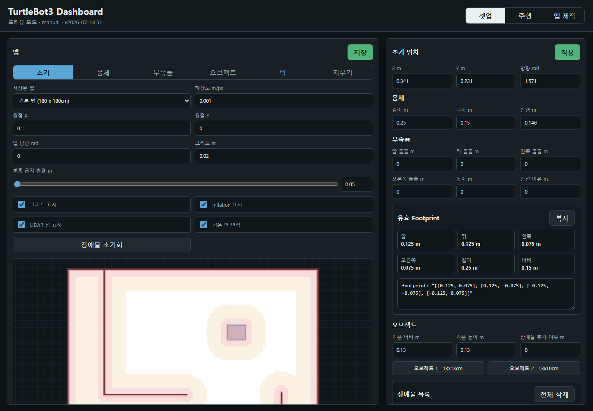

# TurtleBot Dashboard

[한국어](README.md) | [English](README.en.md)

A web dashboard for operating TurtleBot3 Burger robots with ROS 2 Jazzy. It brings map setup, A* path planning, LiDAR-based fallback navigation, manual driving, camera monitoring, multi-robot profiles, and SSH bringup into one interface.

The documented dashboard version is `2026-07-22.97`.

## Multi-Robot Support

The dashboard starts with the `TurtleBot 2` profile. Use the search button next to **Active Robot** to discover ROS/SSH candidates on the local network, then add any discovered robot as a profile. You can also add a profile manually with the `+` button.

Each profile stores its own robot IP address, SSH host/user/password, `ROS_DOMAIN_ID`, map setup, topic names, footprint, and static obstacles. Select a profile before starting or stopping bringup; commands then apply only to that robot.

ROS domains are useful when multiple robots use the same topic names, such as `/scan` and `/amcl_pose`. The dashboard also monitors poses for other configured robots so they can be displayed as movable obstacles on the selected map.

## Screens

### Setup Dashboard

Configure the selected map, walls, static obstacles, robot footprint and attachments, initial pose, ROS 2 topics, SSH settings, and safety distances.



### Drive Dashboard

View the camera feed and FPS, robot pose and route on the map, LiDAR points, and navigation state. The dashboard supports manual driving, destination and waypoint selection, route repetition, route resume, A* direct tracking, diagnostics, and run-log export.


### Map Editor

Create maps at a physical scale, paint and erase walls, zoom with the mouse wheel, and pan with `Shift + drag`. Saved maps are stored locally and can be loaded later from Setup.


## Main Features

- Setup, Drive, and Map Editor tabs
- Local map creation and selection; saved map data is excluded from Git
- Adjustable map dimensions and scale, wall painting/erasing, zoom, pan, load, and delete
- Initial pose, robot footprint, attachment footprint, static obstacle size, position, and rotation setup
- A* route planning for destinations and waypoints, final heading, route repetition, and interrupted-route resume
- Collision-aware route planning using the robot footprint, attachment clearance, prohibited zones, inflation cost, and temporary LiDAR obstacles
- Nav2 action navigation when available, with LiDAR A* direct tracking as a fallback
- LiDAR-based slowdown and avoidance using distance from the robot footprint
- Raw or compressed camera selection with latest-frame MJPEG display and FPS monitoring
- Manual driving, drive logs, diagnostics reports, ROS topic setup, robot checks, and local network robot discovery
- SSH bringup with OpenCR port detection, base bringup as a systemd user service, and optional Nav2/AMCL and camera startup
- Managed shutdown of dashboard-owned base, LiDAR, Nav2, and camera processes

## Requirements

- Python 3.10 or newer
- ROS 2 Jazzy for live robot control and the ROS bridge
- TurtleBot3 Burger with OpenCR
- The dashboard server and robot on the same network
- Matching `ROS_DOMAIN_ID` values for the dashboard server and target robot

Windows can run the UI and map editor in offline preview mode, but live ROS 2 operation requires Ubuntu with ROS 2 Jazzy.

## Run

### Ubuntu / ROS 2 Jazzy

```bash
chmod +x run_ubuntu.sh stop_dashboard.sh stop_robot.sh check_camera.sh
./run_ubuntu.sh
```

To update an existing checkout:

```bash
./stop_dashboard.sh
git pull origin main
./run_ubuntu.sh
```

You can also start the server directly:

```bash
source /opt/ros/jazzy/setup.bash
export ROS_DOMAIN_ID=1
export ROS_LOCALHOST_ONLY=0
python3 server.py --host 0.0.0.0 --port 8080
```

Open `http://localhost:8080/` on the dashboard computer. Other devices on the same network should use the actual server IP shown by the dashboard, for example `http://192.168.20.3:8080/`.

### Windows Preview

```powershell
python server.py --host 127.0.0.1 --port 8080
```

Then open `http://127.0.0.1:8080/`.

## Create a Map

1. In **Map Editor**, set the map name, physical width and height in cm, and the scale in cm per pixel.
2. Click **Create Grid**.
3. Select the pen or eraser and click or drag to paint or erase walls.
4. Use the mouse wheel to zoom and `Shift + drag` to pan.
5. Click **Save Map**. The PNG and metadata are saved under `data/maps/`.
6. In Setup, select a saved map and press **Load** to use it.

The default map is `180 x 180 cm`, `180 x 180 px`, with `1 px = 1 cm`. With a scale of `10 cm/px`, a 180 cm map becomes 18 px wide and each pixel represents `0.1 m`.

## Default ROS 2 Topics

| Purpose | Default topic |
| --- | --- |
| LiDAR | `/scan` |
| Pose | `/amcl_pose` |
| Odometry | `/odom` |
| Manual driving | `/cmd_vel` |
| Initial pose | `/initialpose` |
| Navigation goal | `/navigate_to_pose` |
| Waypoint navigation | `/navigate_through_poses` |
| Camera raw | `/camera/image_raw` |
| Camera compressed | `/camera/image_raw/compressed` |

For a namespaced robot, configure namespaced topics such as `/tb3_1/scan`, `/tb3_1/odom`, and `/tb3_1/cmd_vel`. Use **Reset Topics** in Setup to repopulate topic fields from the current ROS graph.

## ROS 2 Bridge

`server.py` is the backend bridge between the browser and the ROS 2 graph. It is required even with only one robot because the browser cannot publish or subscribe to ROS 2 topics directly.

```text
Browser -> HTTP API -> server.py / rclpy -> /cmd_vel, goals, initial pose
Browser <- HTTP API <- server.py / rclpy <- /scan, /odom, camera
```

In Jazzy, the bridge uses dedicated ROS contexts and executors to process LiDAR, odometry, camera, and action callbacks. For live use, diagnostics must show `mode: ros2` and `rosConnected: true`. `offline-preview` means that the UI is running without the ROS 2 bridge.

## Navigation Flow

1. The browser calculates an A* route using map walls, the robot footprint, static obstacles, prohibited zones, and safety clearances.
2. When Nav2 action servers are available, the dashboard sends the destination or waypoint sequence to Nav2.
3. If Nav2 is unavailable, or **LiDAR Emergency Drive -> A* Direct Tracking** is enabled, the backend tracks the A* route directly using a Pure Pursuit-style controller.
4. Direct tracking requires recent `/scan` and `/odom` data, then publishes to `/cmd_vel`.
5. When a LiDAR point is within the configured clearance of the robot footprint, the controller seeks a safer direction before continuing. The configured slowdown zone uses a fixed reduced speed.

The pink prohibited zone shown on the map is a visual safety buffer. Actual A* collision checks separately include the robot body, attachment envelope, and safety clearances. Inflation zones cost more during planning, so clear space is preferred whenever a valid route exists.

The **Auto-adjust yellow waypoints** option above the Drive map is enabled by default. A newly placed waypoint or final goal in a yellow inflation cell moves to the nearest white cell just outside that clearance zone and briefly shows its before/after coordinates. If no white cell exists, the point stays at the yellow location and is drawn gray. A red prohibited cell is still rejected without adjustment.

Waypoints that are blocked or unreachable are skipped one at a time and the next waypoint is checked. The final goal is never silently skipped: if it is unreachable, the drive does not start.

### Resume a Route

During waypoint driving, the server stores the active waypoint index, completed waypoint index, next unfinished target, destination, and direct-tracking setting in `config/dashboard_state.json`. Use **Resume Drive** after an interruption to validate a fresh route from the current odometry pose to the next remaining waypoint. Run logs include checkpoint events such as `route_checkpoint_started`, `route_checkpoint_updated`, `route_checkpoint_interrupted`, and `route_checkpoint_resumed`.

## Troubleshooting

### Manual driving works, but LiDAR, camera, or autonomous driving does not

Check the diagnostics report and run log for `ros_error`, `rosBridgeError`, `lastScanAt`, `lastOdomAt`, and `lastCameraAt`.

- Confirm diagnostics report `mode: ros2` and an empty `rosBridgeError`.
- Confirm `/scan` and `/odom` have publishers and that `lastScanAt` and `lastOdomAt` are updating.
- Confirm the selected camera topic has a publisher and the camera timestamp/FPS updates.
- Confirm the ROS domain and `ROS_LOCALHOST_ONLY=0` match the target robot.
- If diagnostics show `offline-preview`, start the dashboard from a ROS 2 Jazzy environment, not a Windows preview process.

### A camera topic exists, but no image appears

The camera topic selected in Drive must exactly match the Setup topic. Default values are `/camera/image_raw` and `/camera/image_raw/compressed`; some deployments use a namespace or an extra `camera/` path. Select the exact topic found by `ros2 topic list` or use **Reset Topics**.

Raw mode is sampled at up to 5 FPS to avoid expensive image conversion. Compressed mode uses a latest-frame MJPEG stream, keeps a small frame buffer, and caps browser delivery at 30 FPS. The displayed FPS uses a short smoothing window, so DDS burst delivery can still cause values around 20-40 FPS to fluctuate without indicating a broken camera.

### No Nav2 action server

If `/navigate_to_pose` or `/navigate_through_poses` has no action server, Nav2 navigation cannot be used. Enable **LiDAR Emergency Drive -> A* Direct Tracking** to drive without Nav2. It still requires fresh `/scan` and `/odom` data. If the SSH log reports that `navigation2.launch.py` is missing, install or correct the TurtleBot3 Navigation2 package and launch path on the robot.

## Robot SSH Bringup

Enter the robot IP, SSH account, and ROS domain in Setup, then choose **Robot Bringup**. The dashboard attempts to:

- identify OpenCR on `/dev/ttyACM1` or `/dev/ttyACM0` and reject an Arduino Uno
- launch the TurtleBot3 base bringup with `turtlebot-dashboard-base.service`
- transfer the selected dashboard map as a ROS map file
- start Nav2/AMCL and camera bringup when configured

SSH bringup uses a systemd user service so the base launch survives session termination. On the robot, enable lingering once for the SSH user if necessary:

```bash
sudo loginctl enable-linger kim
```

**Robot Bringup Stop** first publishes a stop command and requests Nav2 lifecycle shutdown. It then sends `Ctrl+C` to dashboard-owned Nav2 and camera tmux sessions, waits for graceful shutdown, and stops the base systemd user service so its LiDAR child process receives `SIGINT`. Processes started manually in a separate terminal are not owned by the dashboard and must be stopped from that terminal with `Ctrl+C` before using dashboard bringup.

When **Robot Bringup Stop** is pressed, the dashboard first looks for the top-level `stop_all.sh` beside the dashboard files. The managed default stores the selected `/cmd_vel`, `/cmd_vel_nav`, `/scan`, `/odom`, camera, and Nav2 lifecycle-manager paths in its config block. It does not rely on a user-made `robot_bringup_all.sh`; the official TurtleBot3 base, LiDAR, and camera bringup are stopped over SSH through Nav2 lifecycle, Ctrl+C, and systemd SIGINT, followed by verification. A user-owned `stop_all.sh` without the managed block is not overwritten.

## Verification

```bash
python3 -m py_compile server.py
python3 -m unittest discover -s tests -v
node --check web/app.js
```

## Runtime Files and Security

- Runtime settings are saved to `config/dashboard_state.json`.
- User-created maps are saved under `data/maps/`.
- Drive logs are saved under `run_logs/`.
- Runtime configuration and SSH passwords are excluded by `.gitignore`.

See `docs/` for the project structure and additional technical documentation.
