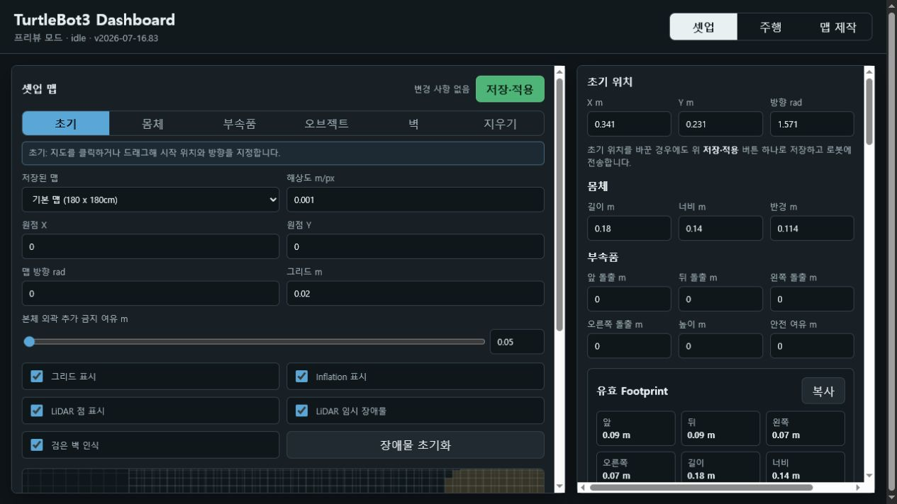
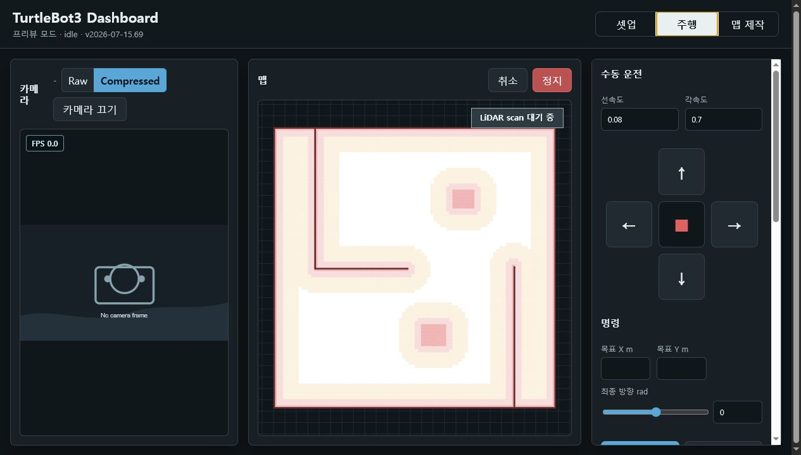
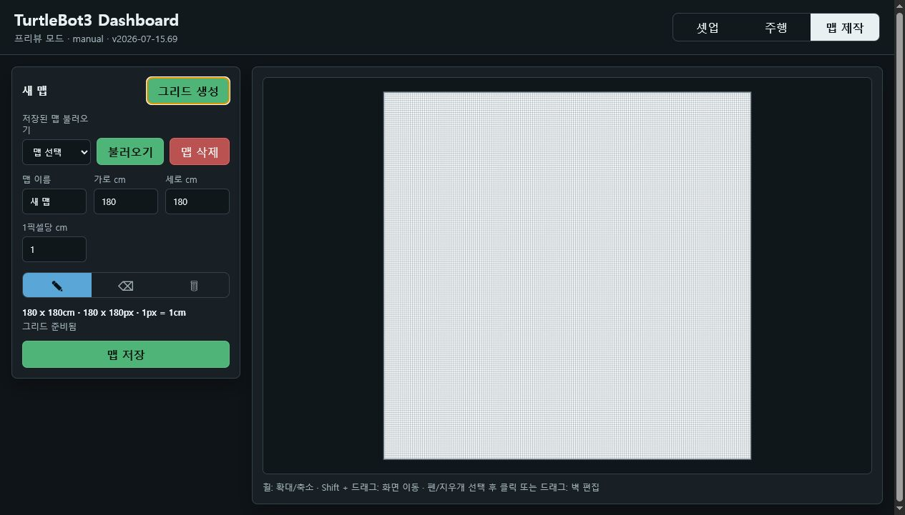

# TurtleBot Dashboard

[한국어](README.md) | [English](README.en.md)

TurtleBot3 Burger와 ROS 2 Jazzy를 위한 로컬 웹 대시보드입니다. 지도 설정, A* 경로 계획, LiDAR 기반 비상 주행, 수동 운전, 카메라 확인, 로봇 SSH 브링업을 한 화면에서 다룹니다.

현재 문서 기준 버전은 `2026-07-21.85`입니다.

## 다중 로봇 (서로 다른 ROS Domain)

처음에는 기본 프로필인 `TurtleBot 2`만 표시됩니다. Active Robot 옆 검색 버튼으로 같은 사설 네트워크의 ROS/SSH 후보를 검색하면 발견된 로봇을 프로필로 추가할 수 있습니다. 검색되지 않는 로봇은 셋업의 `+` 버튼으로 직접 추가하고, **각 프로필별로** Robot IP, SSH Host/User/Password, `ROS_DOMAIN_ID`를 입력해 저장합니다. 로봇별 Domain을 분리하면 토픽 이름은 모두 `/scan`, `/amcl_pose`처럼 같아도 됩니다.

프로필을 선택하면 그 로봇만 제어 대상이 됩니다. `선택 로봇 브링업`과 `선택 로봇 종료`는 선택한 프로필의 SSH와 Domain으로만 동작합니다. 다른 프로필은 Domain별 ROS worker가 `/amcl_pose`를 구독해 같은 지도 좌표계에 표시합니다. 따라서 여러 로봇의 위치를 동시에 보려면 각 로봇이 서로 다른 Domain에서 AMCL을 실행하고 같은 맵 원점을 사용해야 합니다. `/amcl_pose`가 없는 로봇은 등록된 수동 위치값만 표시됩니다.

`OpenCR 확인`은 로봇 SSH에서 OpenCR의 정상 CDC 식별자(STM32 `0483:5740`)를 확인하고, Arduino/알 수 없는 ACM 장치는 거부합니다. 이어 `turtlebot3_node`, `/odom` publisher, `/cmd_vel` subscriber까지 검사해 단순 USB 연결과 실제 TurtleBot base 준비 상태를 구분합니다.

## 화면

### 셋업 대시보드

지도, 벽, 장애물, 로봇 footprint와 안전 반경을 한 화면에서 설정합니다.

셋업의 변경은 상단 `저장·적용` 버튼 하나로 저장됩니다. 선택 로봇의 IP·SSH·ROS Domain·토픽도 함께 반영되며, 초기 위치를 바꾼 경우에는 같은 동작으로 `/initialpose` 전송까지 수행합니다. 저장 결과가 입력한 로봇 연결값과 다르면 화면의 변경사항을 유지하고 오류로 표시합니다.



### 주행 대시보드

카메라 영상과 FPS, 지도 위 로봇 위치, 계획 경로와 LiDAR 점을 함께 확인합니다. 우측 패널에서 수동 운전, 목표 및 경유지 지정, 반복 운행, A* 직접 주행을 제어하고 주행 로그를 수집할 수 있습니다.



### 맵 제작 대시보드

맵의 실제 크기와 `1픽셀당 cm` 비율로 그리드를 생성합니다. 펜과 지우개로 벽을 편집하고, 마우스 휠 확대·축소와 `Shift + 드래그` 이동을 사용해 큰 맵도 다룰 수 있습니다. 완성된 맵은 내부 맵 폴더에 저장한 뒤 셋업 화면에서 선택합니다.



## 주요 기능

- 셋업 / 주행 / 맵 제작 탭
- 저장된 맵 선택과 기본 맵 전환
- 맵 제작: cm 단위 크기, 픽셀 해상도, 벽 그리기/지우기, 확대/이동, 저장/불러오기/삭제
- 맵 제작본은 로컬 `data/maps/`에 저장되고 Git에서는 제외
- 초기 위치, 로봇 크기, 부속품 돌출, 장애물 크기와 위치 설정
- 목표점과 경유지 기반 A* 경로 생성, 최종 방향 지정, 반복 운행, 중단 지점부터 이어서 주행
- 핑크 표시 반경과 본체 충돌 반경을 분리하고 흰색 자유 공간을 우선하는 A* 경로 계획
- Nav2 사용 가능 시 Nav2 실행, 불가능 시 LiDAR A* 직접 추종 사용
- LiDAR 점 표시와 본체 외곽 거리 기반 감속/회피
- Raw/Compressed 카메라 선택, 선택 토픽 단일 구독과 최신 프레임 MJPEG 표시
- 수동 주행, 주행 로그, 진단 보고서
- ROS 2 토픽 설정, 로봇 탭 선택, 같은 사설 네트워크의 SSH 장비 및 ROS 로봇 검색, 로봇 체크
- SSH 브링업: OpenCR 포트 검증 후 systemd 사용자 서비스로 TurtleBot base를 실행하고 Nav2/AMCL, 카메라를 시작
- SSH 브링업 종료: Nav2 lifecycle shutdown과 Ctrl+C(SIGINT) 후 검증을 거쳐 base·LiDAR·Nav2·카메라를 정상 종료

## 요구 사항

- Python 3.10 이상
- ROS 2 Jazzy: 실제 로봇 연결 및 ROS 브리지 사용 시 필요
- TurtleBot3 Burger와 OpenCR
- 같은 네트워크와 동일한 `ROS_DOMAIN_ID`

Windows에서는 ROS 없이도 프리뷰 모드로 UI와 맵 제작 기능을 사용할 수 있습니다.

## 실행

### Ubuntu / ROS 2 Jazzy

```bash
chmod +x run_ubuntu.sh stop_dashboard.sh stop_robot.sh check_camera.sh
./run_ubuntu.sh
```

기존 설치를 최신 코드로 갱신할 때는 실행 중인 대시보드를 종료한 뒤 코드를 받고 다시 시작합니다.

```bash
./stop_dashboard.sh
git pull origin main
./run_ubuntu.sh
```

또는 직접 실행합니다.

```bash
source /opt/ros/jazzy/setup.bash
export ROS_DOMAIN_ID=1
export ROS_LOCALHOST_ONLY=0
python3 server.py --host 0.0.0.0 --port 8080
```

### Windows 프리뷰

```powershell
python server.py --host 127.0.0.1 --port 8080
```

브라우저에서 `http://127.0.0.1:8080/`을 엽니다.

## 맵 제작

1. `맵 제작` 탭에서 맵 이름, 가로/세로 cm, `1픽셀당 cm`을 설정합니다.
2. `그리드 생성`을 누릅니다.
3. 펜으로 벽을 그리고 지우개로 벽을 지웁니다.
4. 휠로 확대/축소하고 `Shift + 드래그`로 화면을 이동할 수 있습니다.
5. `맵 저장`을 누르면 `data/maps/`에 PNG로 저장되고 저장된 맵 목록에 추가됩니다.
6. 저장된 맵을 선택한 뒤 `불러오기`를 누르면 다시 편집할 수 있습니다.

기본값은 `180 x 180cm`, `180 x 180px`, `1px = 1cm`입니다. 예를 들어 `1픽셀당 cm`을 `10`으로 설정하면 180cm 맵은 18px로 생성되며, 저장 맵의 해상도는 `0.1m/px`가 됩니다.

## ROS 2 기본 토픽

기본 로봇 프로필은 루트 namespace의 다음 토픽을 사용합니다.

| 기능 | 기본 토픽 |
| --- | --- |
| LiDAR | `/scan` |
| Pose | `/amcl_pose` |
| Odometry | `/odom` |
| 수동 주행 | `/cmd_vel` |
| 초기 위치 | `/initialpose` |
| 단일 목표 | `/navigate_to_pose` |
| 경유지 목표 | `/navigate_through_poses` |
| 카메라 Raw | `/camera/image_raw` |
| 카메라 Compressed | `/camera/image_raw/compressed` |

검색 또는 직접 추가한 로봇이 namespace를 사용한다면 해당 프로필 토픽을 `/tb3_1/scan`, `/tb3_1/odom` 같은 형식으로 설정합니다. 토픽명과 네트워크 값은 셋업 탭에서 변경할 수 있으며, `토픽 초기화`는 현재 ROS graph에서 발견한 토픽으로 다시 채웁니다.

## ROS 2 브릿지

`server.py`의 ROS 브릿지는 다중 로봇 중계기가 아니라 웹 브라우저와 ROS 2 graph를 연결하는 백엔드 노드입니다. 로봇이 한 대여도 다음 흐름에 필요합니다.

```text
웹 브라우저 -> HTTP API -> server.py/rclpy -> /cmd_vel, 목표 및 초기 위치
웹 브라우저 <- HTTP API <- server.py/rclpy <- /scan, /odom, 카메라
```

ROS 2 Jazzy에서는 전용 `Context`에 연결한 2스레드 executor가 LiDAR, odometry, 카메라와 action callback을 처리합니다. 카메라는 별도 callback group을 사용합니다. 브릿지의 spin이 멈추면 직접 publisher를 호출하는 수동주행은 될 수 있지만 센서 화면과 A* 직접 추종은 함께 멈춥니다. 실제 로봇 연결 시 셋업 또는 진단 화면에서 `mode: ros2`, `rosConnected: true`인지 확인하세요. `offline-preview`는 Windows UI 프리뷰용 상태입니다.

## 운행 방식

1. 지도와 본체 footprint, 장애물을 기반으로 브라우저에서 A* 경로를 계산합니다.
2. Nav2 action server가 정상일 때는 Nav2로 목표/경유지를 전달합니다.
3. Nav2가 없거나 테스트 토글을 켠 경우에는 서버가 A* 경로를 Pure Pursuit 방식으로 직접 추종합니다.
4. LiDAR와 odometry가 최신 상태인지 확인하고 `/cmd_vel` publisher 충돌을 방지합니다.
5. LiDAR 점이 본체 외곽 3cm 이내로 들어오면 빈 방향을 찾아 회피합니다. 감속 구간에서는 설정된 감속 속도로 일정하게 주행합니다.

경로 계획은 로봇의 외접 원 반경을 사용하지 않습니다. 셋업의 초록 로봇 사각형(길이·너비와 부속품) 및 `본체 외곽 추가 금지 여유`가 검은 벽이나 장애물과 겹치지 않는 범위만 금지 영역으로 표시·계산합니다. Inflation 색상 영역에는 높은 이동 비용을 적용하여, 통과 가능한 흰색 공간이 있으면 가까운 색상 영역을 가로지르는 경로보다 흰색 경로를 우선합니다. 셋업의 Inflation 폭은 `저장` 시 `fallbackNavigation.softDistance`로 보존됩니다.

중간 경유지가 장애물 영역에 있거나 A* 경로가 완전히 막힌 경우에는 해당 경유지만 실행 목록에서 제외하고 다음 경유지로 경로를 다시 계산합니다. 최종 목표는 뒤에 대체할 지점이 없으므로 도달할 수 없으면 주행을 시작하지 않습니다. 주행 중 LiDAR 임시 장애물로 재탐색할 때도 같은 규칙을 적용하며, 건너뛴 번호는 경로 상태와 주행 로그에 남깁니다.

### 이어서 주행

경유지 주행을 시작하면 서버가 원본 웨이포인트 번호, 마지막 통과 지점, 다음 미완료 지점, 남은 좌표와 A* 직접 주행 설정을 체크포인트로 저장합니다. 체크포인트는 `config/dashboard_state.json`에 기록되므로 정지·취소·수동 전환이나 대시보드 재시작 뒤에도 유지됩니다. 동적 장애물로 건너뛴 웨이포인트는 통과한 지점으로 기록하지 않습니다.

주행 탭의 `이어서 주행` 버튼은 저장된 체크포인트가 현재 선택한 로봇의 것이고 진행 중인 주행이 없을 때 활성화됩니다. 버튼을 누르면 다음 순서로 복구합니다.

1. 현재 odometry 위치와 다음 미완료 웨이포인트를 확인합니다.
2. 남아 있을 수 있는 이전 Nav2 또는 직접 추종 명령을 취소합니다.
3. 현재 지도, 본체 크기, 금지 영역과 임시 장애물을 반영하여 현재 위치부터 다음 지점까지 A* 경로를 다시 검증합니다.
4. 도달할 수 없는 중간 경유지는 기록을 남기고 다음 지점으로 넘어가며, 최종 목표가 막혀 있으면 재개하지 않습니다.
5. 검증된 남은 경로를 한 번 실행합니다. 기존 반복 설정은 중복 운행을 막기 위해 재개 구간에는 적용하지 않습니다.

화면에는 `마지막 통과 #N · 다음 #N` 형식으로 복구 위치가 표시됩니다. 주행 로그에는 `route_checkpoint_started`, `route_checkpoint_updated`, `route_checkpoint_interrupted`, `route_checkpoint_resumed` 이벤트가 기록되므로 중단 및 재개 과정을 진단 자료와 함께 확인할 수 있습니다. 다른 로봇의 체크포인트는 선택한 로봇을 바꾸기 전에는 실행할 수 없습니다.

실제 주행 전에는 낮은 속도와 넓은 안전 여유로 테스트하고, `/scan`, `/odom`, TF, `/cmd_vel` 수신 상태를 로봇 체크에서 확인하세요.

수동 운전 중 브라우저가 포커스를 잃거나 페이지를 닫으면 마지막 수동 속도를 반드시 0으로 정지합니다. 수동 명령이 활성화되지 않은 상태에서는 페이지 새로고침이나 탭 전환만으로 `/cmd_vel` 정지 명령을 보내지 않으므로 진행 중인 자율주행을 취소하지 않습니다.

## 문제 해결

### 수동주행만 되고 LiDAR·카메라·자율주행이 안 될 때

진단 보고서와 주행 로그에서 `ros_error`, `rosBridgeError`, `lastScanAt`, `lastOdomAt`, `lastCameraAt`을 확인합니다. `2026-07-16.73`까지 발생할 수 있던 다음 오류는 `2026-07-16.74`에서 Jazzy executor 방식으로 수정됐습니다.

```text
ROS spin stopped: spin() got an unexpected keyword argument 'context'
```

최신 코드를 받은 뒤 대시보드를 재시작하고 다음 상태를 확인합니다.

- 진단의 `mode`가 `ros2`이고 `rosBridgeError`가 비어 있음
- `/scan`, `/odom`에 publisher가 있고 `lastScanAt`, `lastOdomAt`이 갱신됨
- 선택한 Raw 또는 Compressed 카메라 토픽에 publisher가 있고 `lastCameraAt`과 FPS가 갱신됨
- A* 직접 주행 시작 시 `fallback_waiting_sensors`가 계속 유지되지 않음

### 카메라 토픽은 있지만 화면이 안 나올 때

주행 탭의 Raw/Compressed 선택과 셋업 토픽이 실제 ROS graph와 일치해야 합니다. 기본값은 `/camera/image_raw`와 `/camera/image_raw/compressed`입니다. 카메라 보정 YAML 누락 경고는 거리 보정 정보가 없다는 뜻이며 영상 publisher가 정상이라면 프레임 수신 자체를 막지는 않습니다.

Raw 모드는 Python BMP 변환과 네트워크 부하를 제한하기 위해 최대 약 5 FPS로 샘플링합니다. Compressed 모드는 반복 HTTP 폴링 대신 MJPEG 스트림을 사용합니다. 선택한 Raw 또는 Compressed 토픽 하나만 구독하고, 1프레임 ROS QoS 큐와 전용 callback group으로 LiDAR 처리 중에도 최신 영상을 우선합니다. 짧게 몰려오는 JPEG는 최대 8프레임만 임시 보관하지만, MJPEG 전송 시에는 대기열을 순서대로 비우지 않고 항상 가장 최신 프레임을 보냅니다. 따라서 카메라 입력이 출력 한계인 30 FPS를 넘으면 중간 프레임은 의도적으로 건너뛰며, 영상 지연이 누적되지 않습니다. JPEG 쓰기 시간도 30 FPS 간격에 포함하므로 불필요하게 출력 속도가 낮아지지 않습니다. 화면 FPS는 5초 수신 창을 0.5초마다 완만하게 갱신해 DDS의 순간적인 묶음 전달 때문에 20~40 FPS로 요동하는 현상을 줄입니다. 첫 프레임을 받기 전이나 카메라가 꺼진 상태는 `FPS -`로 표시합니다.

진단 보고서와 주행 로그의 `cameraSubscriptionTopic`, `cameraSubscriptionQueueDepth`, `cameraExecutorThreads`, `cameraFps`, `cameraBufferedFrames`, `cameraFrameGapMs`로 실제 구독 토픽, 수신 속도와 프레임 간격을 확인할 수 있습니다. Compressed 모드에서는 큐 깊이 `1`, executor 스레드 `2`, 설정한 Compressed 토픽이 표시되어야 합니다. 진단 중에는 Raw와 Compressed 속도를 동시에 측정하지 않고 선택된 Compressed 토픽 하나만 별도로 측정하므로 진단 자체가 영상 대역폭을 잠식하지 않습니다. 토픽명에 `camera` 문자열이 없어도 설정된 Compressed 토픽을 카메라 측정으로 분류합니다. 보고서의 비교 명령은 선택 로봇에 저장된 `ROS_DOMAIN_ID`와 `ROS_LOCALHOST_ONLY`를 사용합니다.

### Nav2 action server가 없을 때

`/navigate_to_pose`와 `/navigate_through_poses` action server가 없으면 Nav2 방식은 사용할 수 없습니다. 주행 탭의 `LiDAR 비상주행 준비 -> A* 경로 직접 추종` 토글을 사용하면 Nav2 없이도 이동할 수 있지만, 최신 `/scan`과 `/odom` 데이터는 반드시 필요합니다. SSH 로그에 `navigation2.launch.py` 파일 누락이 보이면 로봇의 TurtleBot3 Navigation2 패키지 또는 launch 경로를 별도로 수정해야 합니다.

## 로봇 SSH 브링업

셋업 탭에 로봇 IP, SSH 계정, ROS domain을 입력한 뒤 `로봇 브링업`을 누르면 다음을 시도합니다.

- `/dev/ttyACM1`, `/dev/ttyACM0`에서 OpenCR 식별 및 Arduino Uno 제외
- `turtlebot-dashboard-base.service` 사용자 서비스로 TurtleBot3 base bringup
- 현재 선택한 대시보드 맵을 ROS map 파일로 전송
- Nav2/AMCL과 카메라 bringup

`로봇 브링업`은 SSH 사용자의 systemd 서비스를 로그인 종료 후에도 유지하도록 linger 설정을 확인합니다. 꺼져 있으면 먼저 비밀번호 없는 sudo를 시도하고, 이어서 셋업에 저장된 SSH 비밀번호로 자동 활성화합니다. 로봇 계정에 sudo 권한이 없거나 sudo 비밀번호가 SSH 비밀번호와 다를 때만 로봇에서 아래 명령을 한 번 직접 실행하면 됩니다.

```bash
sudo loginctl enable-linger kim
```

`브링업 종료`는 먼저 정지 명령을 보내고 Nav2 lifecycle manager에 shutdown을 요청합니다. 이어 dashboard가 만든 Nav2·카메라 tmux 세션에 `Ctrl+C`를 보내 최대 12초간 정상 종료를 기다립니다. base는 `systemctl --user stop turtlebot-dashboard-base.service`로 service cgroup 전체에 `SIGINT`를 전달하므로 LiDAR 자식 프로세스도 `Ctrl+C`와 같은 순서로 종료됩니다. 시간 안에 끝나지 않은 dashboard tmux/nohup 세션만 제한적으로 강제 종료하며, 수동으로 실행한 ROS 프로세스는 종료하지 않고 검증 실패로 표시합니다.

직접 SSH 터미널에서 실행한 기존 `ros2 launch`는 대시보드가 소유하지 않으므로 자동 종료하지 않습니다. 한 번 `Ctrl+C`로 종료한 뒤 대시보드 브링업으로 전환하세요.

## 검증

```bash
python3 -m py_compile server.py
python3 -m unittest discover -s tests -v
node --check web/app.js
```

## 저장 파일과 보안

- 실행 중 설정은 `config/dashboard_state.json`에 저장됩니다.
- 사용자 제작 맵은 `data/maps/`에 저장됩니다.
- 주행 로그는 `run_logs/`에 저장됩니다.
- 위 파일과 SSH 비밀번호가 포함될 수 있는 로컬 설정은 `.gitignore`로 Git에서 제외됩니다.

프로젝트 구조와 상세 자료는 `docs/`를 참고하세요.
